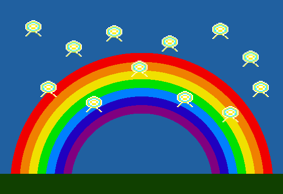

# VERA Graphics & Sound Test Demo Disk for Apple II / Apple2TS



A showcase and test suite demonstrating **VERA (Versatile Embedded Retro Adapter)** FPGA graphics & 16-Voice stereo PSG audio card emulation running on **Apple II** computers (Slot 2 and Slot 4), created for [Apple2TS](https://apple2ts.com).

---

## 🌟 Features

- **Automatic Dual-Slot Hardware Probing**:
  - Automatically identifies whether VERA is installed on **Slot 2** (`$C200`) or **Slot 4** (`$C400`).
  - Bulletproof VRAM signature readback preventing false positive detections with other Slot 4 cards (e.g. Mockingboard).
- **16-Sprite Hardware Bouncing Animation (`SPRITE.BIN`)**:
  - 16 simultaneous $16 \times 16$ 4bpp crystal alien sprites animating with zero flicker and 2x pixel scaling.
- **Rich 4-Voice Polyphonic Stereo Chiptune (`SPRSND.BIN`)**:
  - Voice 1: 25% Duty Cycle Pulse Wave Lead Melody.
  - Voice 2: Sawtooth Wave Counter-Harmony & Stereo Widening.
  - Voice 3: Triangle Wave Slap / Disco Bassline.
  - Voice 4: Percussion Section (Kick drum, Snare noise, and Hi-hats) with dynamic volume decay.
- **256-Color Mode 7 Bitmap Display (`MODE7.BIN`)**:
  - $320 \times 240$ 8bpp full color palette rainbow arc.
  - Fast 6502 RLE decompression engine loading high-res images in real time.
- **100% Genuine ProDOS 2.4.3 Boot Disk (`veratest.po`)**:
  - Fully bootable on real hardware and Apple II emulators.

---

## 🚀 Building from Source

Requires [Node.js](https://nodejs.org/) v18+:

```bash
git clone https://github.com/anomixer/veratest.git
cd veratest
npm run build
```

This compiles all 6502 assembly routines, packs the ProDOS disk image into `veratest.po`, generates the high-res screenshot `veratest.png`, and automatically syncs with your local Apple2TS repository if present.

---

## 🕹️ Running the Demo in Apple2TS

1. Open [Apple2TS](https://apple2ts.com).
2. Insert a **VERA** card into **Slot 2** or **Slot 4** in the Slot Configuration panel.
3. Open the **Disk Collection** $\rightarrow$ **New Releases**, and click **VERA Graphics & Sound Demo**.
4. Open the **VERA Monitor** tab on the right side of the screen to inspect live VERA VRAM, Sprites, and Palette registers!

---

## 🙏 Special Acknowledgements & Credits

Special thanks to the original creators and contributors whose work made VERA and its TypeScript emulation possible:

Frank van den Hoef – Creator and hardware designer of the VERA FPGA system.
Michael Steil – Commander X16 emulator architecture and core implementation.
David Murray (The 8-Bit Guy) – Creator and visionary of the Commander X16 project.
Michael Morrison – Porting the VERA core to TypeScript and adapting it for Apple II / web emulation.

---

## 📜 License

MIT License. Created by [anomixer](https://github.com/anomixer).
